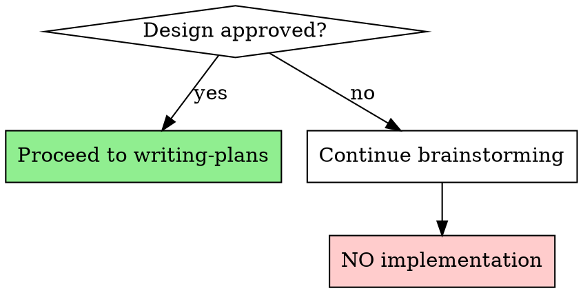

# Brainstorming

## Overview

Transform ideas into approved designs before any implementation begins.

**Core principle:** "Do NOT invoke any implementation skill, write any code, scaffold any project, or take any implementation action until you have presented a design and the user has approved it."

This applies universally, regardless of project complexity. "Simple" projects frequently contain unexamined assumptions that cause wasted work.

## The Hard Gate

**The ONLY skill invoked after brainstorming is `writing-plans`.** No implementation tools until the design approval gate is fully satisfied.

## The Process

1. **Explore project context** — read existing files and documentation
2. **Offer visual companion** — if topic involves visual questions, offer a browser-based tool (separate message, explicit consent required)
3. **Ask clarifying questions sequentially** — one question at a time, multiple-choice preferred; focus on purpose, constraints, and success criteria
4. **Propose 2–3 alternative approaches** — with explicit trade-offs for each
5. **Present design sections and obtain approval after each** — scale section depth to complexity (a few sentences for simple items, up to 300 words for nuanced topics)
6. **Write design documentation** — save to `docs/superpowers/specs/YYYY-MM-DD-<topic>-design.md`
7. **Conduct self-review** — check for placeholders, contradictions, and missing detail
8. **Request user review** of the written specification
9. **Invoke `writing-plans`** to create implementation guidance

## Key Practices

- Ask **one question at a time** — never bundle questions
- Use **multiple-choice formats** when feasible
- Explore **alternative solutions** before finalising approach
- **Validate incrementally** — get user approval after each design section
- Never skip this process for "simple" work

## Red Flags

**Never:**
- Write any code before design is approved
- Skip alternatives because one approach seems obvious
- Bundle multiple questions together
- Proceed to implementation with unanswered questions

## Integration

**Called by:** Any new feature, system design, or significant change

**Only invokes:**
- **superpowers:writing-plans** — after design is fully approved

**Followed by:**
- **superpowers:using-git-worktrees** — set up isolated workspace (called from writing-plans/executing-plans)
