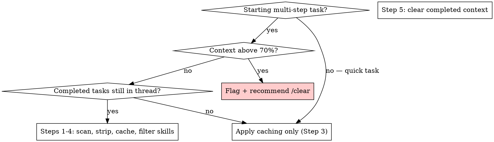

# Context Optimization

## Overview

A bloated context window degrades response quality, increases latency, and burns token budget on stale information. Proactive management keeps sessions sharp and cheap.

**Core principle:** Context is finite working memory — keep only what the current task needs, cache what's repeated, and clear what's done.

## When to Use



**Use when:**
- Starting any task expected to take 3+ turns
- Responses feel slow or begin missing details discussed earlier
- Multiple resolved tasks are still active in the thread
- System prompts or tool schemas are sent on every API turn without caching
- Entering a new task inside a long-running session

**Don't use for:**
- Single-turn questions in a fresh session
- Sessions with fewer than 3 turns of history

---

## The Process

### Step 1: Scan Context Before Starting

Audit the current thread before beginning any multi-step task:

```
[ ] How many completed tasks are still unreduced in the thread?
[ ] Are any conversation branches resolved and no longer active?
[ ] Are large documents or code blocks repeated across turns?
[ ] Is the system prompt or tool schema sent every turn without caching?
[ ] Estimate: what % of the context window is consumed?
```

**If the estimate exceeds 70% → skip to Step 6 immediately.**

---

### Step 2: Strip Redundant Information

Identify and collapse stale content:

| Pattern | Action |
|---------|--------|
| Resolved conversation branches | Summarize to 1–2 sentences |
| Repeated document or code blocks | Replace with `[document summarised: <title>]` |
| Completed multi-step tasks | Collapse to one line: `✓ <what was done>` |
| Intermediate tool results superseded by final result | Keep final only |
| Restated requirements | Remove restatements; keep single canonical version |

**Never strip:**
- Active task requirements or open decisions
- Uncommitted code that is still needed
- User decisions that apply to ongoing work
- Error context for an unresolved bug

---

### Step 3: Apply Prompt Caching

Add `cache_control: ephemeral` to any content sent on multiple consecutive turns:

```python
# System prompts longer than ~1 000 tokens
system=[{
    "type": "text",
    "text": SYSTEM_PROMPT,
    "cache_control": {"type": "ephemeral"},
}]

# Tool schemas passed on every turn
tools=[{**TOOL_DEFINITION, "cache_control": {"type": "ephemeral"}}]

# Grounding documents consulted more than once
{"type": "text", "text": DOCUMENT, "cache_control": {"type": "ephemeral"}}
```

**Cache when:**
- System prompt exceeds ~1 000 tokens
- Tool schemas are sent on every API call
- A reference document is used across multiple turns

**Don't cache:**
- Content that changes every turn
- Short system prompts under ~500 tokens (overhead exceeds benefit)

---

### Step 4: Load Only Relevant Skills

Match skills to the task type — never load all skills speculatively:

| Task type | Skills to load |
|-----------|---------------|
| Planning / design | `brainstorming`, `writing-plans` |
| Execution (same session) | `subagent-driven-development` |
| Execution (separate session) | `executing-plans` |
| Debugging | `systematic-debugging`, `verification-before-completion` |
| Code review | `requesting-code-review`, `receiving-code-review` |
| Writing a skill | `writing-skills`, `test-driven-development` |
| Branch completion | `finishing-a-development-branch`, `using-git-worktrees` |

Each unneeded skill loaded adds tokens to every turn for the rest of the session.

---

### Step 5: Clear Completed Task Context

Before starting a new task in an existing session:

1. Write a one-line completion summary for each finished task:
   ```
   ✓ Implemented parallel_research.py — ThreadPoolExecutor pipeline, error-isolated per topic
   ✓ Installed 14 Superpowers skills to .claude/skills/
   ```
2. Drop the detailed conversation that produced those outcomes.
3. Carry forward only: active requirements, open decisions, and uncommitted changes.

If the session does not support explicit context management, state the summary at the top of the next message so it is available in any continuation.

---

### Step 6: Flag and Recommend /clear

When context exceeds 70% capacity, stop and surface the situation explicitly:

```
⚠️ Context is above 70% full.

Work to preserve before clearing:
- [uncommitted code / open decisions / active requirements]

Recommended: run /clear, then paste the above to resume cleanly.
```

**Never silently continue past 70%.** Degraded quality from a bloated context is harder to recover from than a brief interruption to clear.

---

## Quick Reference

| Trigger | Action |
|---------|--------|
| Starting 3+ turn task | Run Step 1 (scan) |
| Context >70% full | Step 6 — flag immediately, recommend /clear |
| Repeated system prompt | Step 3 — add `cache_control: ephemeral` |
| Completed task still in thread | Step 2 — collapse to 1-line summary |
| Loading skills | Step 4 — load task-relevant only |
| New task in existing session | Step 5 — clear completed context first |

---

## Common Mistakes

| Mistake | Fix |
|---------|-----|
| Loading all skills "just in case" | Use Step 4 table — match skills to task type |
| Continuing past 70% without flagging | Flag first, always — quality degrades silently |
| Caching short prompts | Only cache content >~1 000 tokens |
| Stripping active requirements | Check "Never strip" list before collapsing anything |
| Summarising too aggressively | Collapse completed work; preserve active decisions verbatim |
| Treating the 70% flag as optional | It is not optional — surface it every time |

---

## Red Flags

Stop and run context optimization when:

- Responses start missing details that were established earlier in the session
- API calls are taking noticeably longer than at the start of the session
- You are re-reading the same document or code block more than twice
- Three or more tasks have completed without any context being cleared
- A system prompt or tool schema is sent unsanitized on every turn
- You catch yourself thinking "I'll just keep going, it's probably fine"
