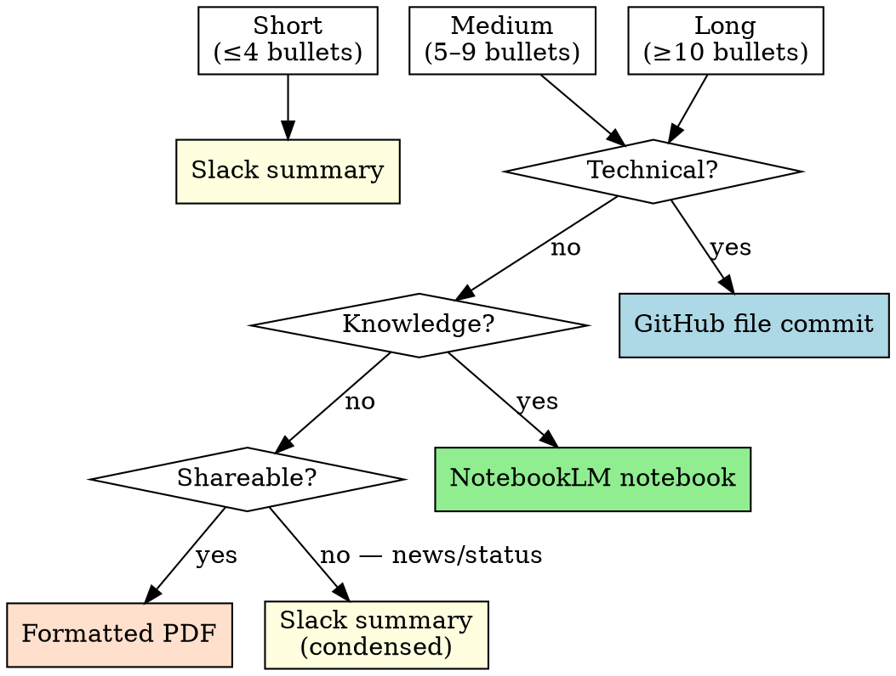

# Output Router

## Overview

A `ResearchReport` has no value until it reaches the right destination. A 15-bullet technical deep-dive sent to Slack gets ignored; a 2-bullet news item committed to a docs repo pollutes a codebase.

**Core principle:** Length determines the format family. Topic type determines the specific channel. Override signals take precedence over both.

---

## Routing Decision

### Step 1 — Classify Length

| Label | Bullet count |
|-------|-------------|
| Short | ≤ 4 bullets |
| Medium | 5–9 bullets |
| Long | ≥ 10 bullets |

Short reports → **Slack summary** (skip Steps 2–3).

---

### Step 2 — Classify Topic Type

Scan the `topic` string and `bullets` for the strongest signal:

| Signal words / characteristics | Type |
|-------------------------------|------|
| code, API, SDK, library, framework, tool, engineering, implementation, architecture, repository | **Technical** |
| science, research, concept, history, reference, knowledge, ongoing study, literature | **Knowledge** |
| business, market, strategy, stakeholder, executive, investor, presentation, shareable, report | **Shareable** |
| news, update, status, current events, recent developments, trending, announcement | **News** |

When signals are mixed, pick the strongest one. If genuinely ambiguous, ask the user before routing.

---

### Step 3 — Apply Routing Table



---

### Step 4 — Check Override Signals

Apply these before executing the routed action. Overrides take precedence over the base routing table.

| Signal | Override destination |
|--------|---------------------|
| `report` field contains fenced code blocks | → GitHub commit |
| `len(sources) > 10` | → NotebookLM |
| User said "share with the team" | → Slack |
| User said "add to docs" or "commit this" | → GitHub commit |
| User said "send as a report" or "make a PDF" | → PDF |
| `len(bullets) == 0` | → Ask user — do not route empty report |

---

## Output Actions

### Slack Summary

Compress to a Slack-safe message. Maximum 5 bullets — rank by importance, drop the rest.

```
*<topic>* — Research Summary

• <bullet 1>
• <bullet 2>
• <bullet 3>
• <bullet 4 — include only if present>
• <bullet 5 — include only if present>

Sources: <len(sources)> | Queries issued: <len(search_queries)>
```

---

### GitHub File Commit

Write the full `report` field (already formatted Markdown) directly to the repo.

```python
# Path convention
path = f"docs/research/{date.today().isoformat()}-{topic_slug}.md"

# Commit message convention
message = f"Add research report: {report.topic}"
```

Do not truncate or reformat — the `report` field is commit-ready as-is.

---

### NotebookLM Notebook

Export as a structured document for upload. Save locally; NotebookLM ingests via file upload.

```markdown
# <topic>

## Summary
<executive summary paragraph from report>

## Key Findings
<bullets as markdown list>

## Sources
<numbered source URLs>

## Metadata
- Research date: <YYYY-MM-DD>
- Queries issued: <search_queries joined by ", ">
- Source count: <len(sources)>
```

```python
# Path convention
path = f"docs/research/notebooks/{date.today().isoformat()}-{topic_slug}.md"
```

---

### Formatted PDF

Wrap the report in pandoc-compatible front matter and save to the PDF staging directory.

```markdown
---
title: "<topic>"
date: "<YYYY-MM-DD>"
author: "Research Agent"
geometry: margin=1in
---

<report field content>
```

```python
# Path convention
path = f"docs/research/pdf/{date.today().isoformat()}-{topic_slug}.md"

# Render with:
# pandoc <path>.md -o <path>.pdf
```

---

## Quick Reference

| Topic type | Length | Destination |
|------------|--------|-------------|
| Any | Short (≤4) | Slack |
| Technical | Medium–Long | GitHub commit |
| Knowledge / reference | Medium–Long | NotebookLM |
| Shareable / professional | Medium–Long | PDF |
| News / status | Medium–Long | Slack (condensed) |
| Contains code blocks | Any | GitHub (override) |
| Sources > 10 | Any | NotebookLM (override) |
| Empty bullets | Any | Ask user |

---

## Common Mistakes

| Mistake | Fix |
|---------|-----|
| Sending long technical reports to Slack | Check length first — ≥5 bullets + technical → GitHub |
| Committing news summaries to docs | News type always routes to Slack |
| Skipping override signal check | Always run Step 4 before acting |
| Truncating bullets for GitHub | GitHub receives the full unmodified `report` field |
| Defaulting every report to one destination | Route per report — topic and length both matter |
| Routing a report with 0 bullets | Stop and ask — never route an empty result |

---

## Red Flags

Stop and ask the user before routing when:

- Topic type signals are genuinely mixed (e.g. technical content framed as an executive summary)
- The report has 0 bullets or 0 sources — delivery would mislead the recipient
- The user's downstream intent was not captured in the original request
- Bullet count sits exactly at a boundary (4–5) and the topic type is also ambiguous
- The chosen destination doesn't exist yet (e.g. `docs/research/` directory not in repo)
