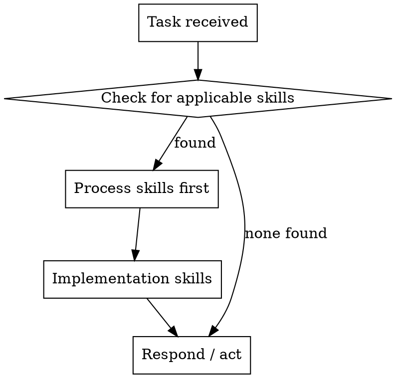

# Using Superpowers

## Core Principle

Invoke relevant or requested skills BEFORE any response or action.

**Even a 1% chance a skill might apply means you should invoke the skill to check.**

## Hierarchy

1. **User instructions** (CLAUDE.md, AGENTS.md) — absolute precedence
2. **Skills** — override default system behavior
3. **Default behavior** — fallback only

If CLAUDE.md says "don't use TDD" and a skill says "always use TDD," follow the user's instructions.

## Skill Invocation Order

**Process skills** (brainstorming, debugging, planning) come before **implementation skills** (design, building, coding).

## Skill Types

| Type | Behaviour |
|------|-----------|
| **Rigid** | Exact adherence required (TDD, verification-before-completion) |
| **Flexible** | Adapt to context (design patterns, reference guides) |

## Platform Access

| Platform | Tool |
|----------|------|
| Claude Code | `Skill` tool |
| Copilot CLI | `skill` tool |
| Gemini CLI | `activate_skill` |

## Red Flags — You're Rationalizing

Stop and check for applicable skills when you think:
- "This is just a simple question"
- "I'll do this one thing first, then check skills"
- "No skill applies here"
- "I already know how to do this"

**These thoughts signal you should check for skills, not skip them.**
